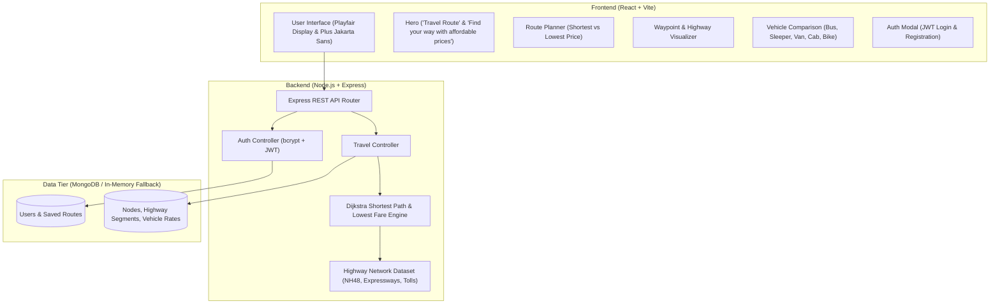

# 🚗 Travel Route
> **Find your way with affordable prices**

A full-stack **MERN (MongoDB, Express.js, React.js, Node.js)** road travel navigation and fare optimization platform. It calculates the **shortest path** (in physical kilometers) and the **lowest price roadway path** (factoring distance, vehicle fuel rates, and highway toll fees) between any two destinations across national highways and expressways.

---

## 🏛️ System Architecture



---

## 📐 Pathfinding & Lowest-Price Algorithms

### 1. Shortest Distance Path (Standard Dijkstra)
Minimizes total physical road distance:
$$\min \sum_{(u, v) \in P} \text{Distance}(u, v)$$

### 2. Lowest Price Path (Cost-Weighted Dijkstra)
Evaluates roadway segments based on passenger vehicle class, toll-avoidance alternatives, and per-km mileage rates:
$$\min \sum_{(u, v) \in P} \Big( \text{Distance}(u, v) \times \text{Rate}_{\text{vehicle}} + \text{Toll}(u, v) \times \text{Multiplier}_{\text{vehicle}} \Big)$$

### 3. Multi-Vehicle Roadway Classes
| Road Vehicle Class | Capacity | Base Fare | Rate / km | Toll Share | Best For |
|---|---|---|---|---|---|
| **Express Roadway Bus** | 45 Seats | ₹120 | ₹1.40/km | 25% (Shared) | **Lowest Price** |
| **Luxury Volvo AC Sleeper** | 32 Berths | ₹350 | ₹2.30/km | 35% (Shared) | Long-distance comfort |
| **Shared Road Shuttle/Van** | 7–12 Seats| ₹180 | ₹2.10/km | 40% (Shared) | Economy group transit |
| **Budget Hatchback Taxi** | 4 Seats | ₹250 | ₹9.50/km | 100% (Solo) | Affordable private cab |
| **Executive Sedan / SUV** | 4–6 Seats | ₹450 | ₹13.00/km | 100% (Solo) | Speed & luxury travel |
| **Two-Wheeler Tourer** | 1–2 Riders| ₹80 | ₹3.20/km | 0% (Toll-Free) | Solo adventure |

---

## 📁 Project Directory Structure

```
travel-route/
├── backend/
│   ├── .env                       # Environment variables (PORT, JWT_SECRET, MONGODB_URI)
│   ├── .env.example
│   ├── package.json
│   └── src/
│       ├── server.js              # Express app bootstrap & middleware
│       ├── config/
│       │   └── db.js              # MongoDB connection with zero-crash fallback
│       ├── algorithms/
│       │   └── dijkstra.js        # Dijkstra graph solver (distance, time, cost)
│       ├── data/
│       │   └── networkData.js     # National highway network, city nodes, and rates
│       ├── models/
│       │   ├── User.js            # User authentication model
│       │   └── RouteNetwork.js    # Graph node and edge schemas
│       ├── controllers/
│       │   ├── authController.js  # Register, login, profile
│       │   └── travelController.js# Route calculation, comparison, booking
│       └── routes/
│           ├── authRoutes.js      # /api/auth endpoints
│           └── travelRoutes.js    # /api/travel endpoints
│
└── frontend/
    ├── index.html                 # HTML template with Google Fonts
    ├── package.json
    ├── vite.config.js             # Vite proxy setup for backend
    └── src/
        ├── main.jsx               # React entry point
        ├── App.jsx                # Main page assembling all components
        ├── index.css              # Custom responsive stylesheet
        ├── api/
        │   └── client.js          # REST API client with offline fallback
        └── components/
            ├── Navbar.jsx         # Header bar with user profile & emergency phone
            ├── Hero.jsx           # Title: "Travel Route", Subtitle: "Find your way with affordable prices"
            ├── RoutePlanner.jsx   # Form with criteria toggles (Shortest vs Lowest Price)
            ├── RouteMapVisualizer.jsx # Waypoint timeline & highway breakdown
            ├── VehicleComparison.jsx  # Multi-vehicle fare comparison cards
            ├── WhyChooseUs.jsx    # 3-feature card layout inspired by reference design
            ├── PopularRoadways.jsx# Scenic highway journeys
            ├── AuthModal.jsx      # Login & Register modal (with 1-click Demo Fill)
            ├── BookingModal.jsx   # Ticket confirmation & reservation card
            └── Footer.jsx         # Dark luxury footer matching reference design
```

---

## 🚀 How to Run the Project

### 1. Run the Backend Server
```bash
cd backend
npm install
npm start
```
* The server will start on **`http://localhost:5000`**.
* *Note: If MongoDB is not running locally, the server automatically starts in High-Performance In-Memory mode without errors.*

### 2. Run the Frontend Development Server
Open a new terminal window:
```bash
cd frontend
npm install
npm run dev
```
* The frontend will start on **`http://localhost:3000`**.
* Open your browser and navigate to `http://localhost:3000`.

---

## 🔑 Demo Login Credentials

For quick evaluation without registration, you can use:
* **Email:** `traveler@route.com`
* **Password:** `password123`
*(Or click the **"Fill Demo Credentials (1-Click)"** button inside the Login modal).*

---

## 📡 Key API Endpoints

| Method | Endpoint | Description |
|---|---|---|
| `GET` | `/api/travel/cities` | List all available city nodes |
| `GET` | `/api/travel/vehicles` | List roadway vehicles with rate parameters |
| `POST` | `/api/travel/calculate` | Calculate shortest path, cheapest route, and vehicle comparison |
| `POST` | `/api/travel/book` | Create roadway travel ticket reservation |
| `POST` | `/api/auth/register` | Register new user account |
| `POST` | `/api/auth/login` | Authenticate user and receive JWT |
| `GET` | `/api/auth/me` | Fetch authenticated user profile |
